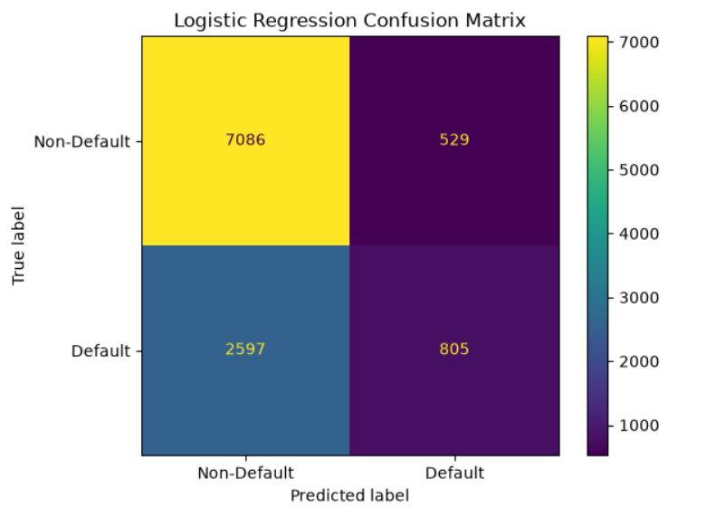

# Logistic Regression & XGBoost for Risk-Based Credit Analysis

## Project Overview

This project investigates the following research question:

> **"Can machine learning models accurately predict loan default risk, and how can these predictions support risk-based lending decisions?"**

Using Prosper loan data, the project develops a credit default risk analysis framework that goes beyond prediction by incorporating risk segmentation, expected loss analysis, and threshold-based lending decisions.

---

## Key Results

| Metric | Logistic Regression | XGBoost |
|---|---:|---:|
| ROC-AUC | 0.716 | **0.771** |
| Default Precision | 0.60 | **0.67** |
| Default Recall | 0.24 | **0.35** |
| Default F1 | 0.34 | **0.46** |
| KS Statistic | - | **0.396** |

XGBoost achieved stronger predictive performance than Logistic Regression and was therefore used for the subsequent risk analysis.

---

## Project Workflow

**Data Preparation → Default Risk Prediction → Model Evaluation → Probability Calibration → Model Explainability → Risk Segmentation → Expected Loss Analysis → Threshold Analysis → Credit Decision**

---

## Dataset

The project uses the **Prosper Loan Data** dataset from Kaggle.

The original dataset contains:

- **113,937 observations**
- **81 variables**

After filtering loans with known outcomes, **55,084 observations** were used for modeling.

The target variable was defined as:

- `0` → Non-Default
- `1` → Default

The resulting default rate was **30.88%**.

---

## Data Preparation

The preprocessing stage included:

- Creating the binary default target
- Removing post-loan performance variables
- Controlling for data leakage
- Removing identifier variables
- Handling missing values
- Encoding categorical variables
- Separating date variables from categorical features
- Stratified train/test splitting

The dataset was divided into **80% training** and **20% testing** data.

After preprocessing and one-hot encoding, the modeling dataset contained **174 features**.

---

## Models

### Logistic Regression

Logistic Regression was used as a baseline classification model for predicting loan default risk.

### XGBoost

XGBoost was used as the main predictive model because it can capture nonlinear relationships and feature interactions.

The model achieved a **ROC-AUC of 0.771**, compared with **0.716** for Logistic Regression.

---

## Model Performance

### ROC Curve Comparison


The ROC curve shows the stronger discrimination performance of XGBoost compared with Logistic Regression.

### Logistic Regression Confusion Matrix



---

## KS Statistic

The XGBoost model achieved a **KS statistic of 0.3964**, providing an additional measure of the model's ability to distinguish between default and non-default observations.

---

## Probability Calibration

The predicted default probabilities were calibrated before being used in risk segmentation, expected loss, and threshold analysis.


The calibration curve compares the predicted default probabilities with the observed default rates.

---

## Model Explainability

Feature importance and SHAP analysis were used to interpret the XGBoost model.

### XGBoost Feature Importance


### SHAP Summary Plot


The analysis highlights variables such as:

- Monthly Loan Payment
- Stated Monthly Income
- Total Inquiries
- Debt-to-Income Ratio
- Credit Score
- Borrower Rate
- Current Delinquencies

SHAP results describe relationships learned by the model and should not be interpreted as causal effects.

---

## Risk Segmentation

The calibrated default probabilities were divided into four equal-sized risk groups using a quartile-based approach:

- Low
- Medium
- High
- Very High

| Risk Group | Loan Count | Average PD | Actual Default Rate |
|---|---:|---:|---:|
| Low | 2,755 | 10.33% | 7.95% |
| Medium | 2,754 | 19.40% | 21.31% |
| High | 2,754 | 32.65% | 33.33% |
| Very High | 2,754 | 61.52% | 60.93% |

The actual default rate increases consistently across the risk groups, indicating that the model is able to meaningfully rank loans by risk.


---

## Expected Loss Analysis

Expected Loss was used to translate predicted default risk into a monetary risk measure.

The following formula was applied:

**Expected Loss = PD × EAD × LGD**

Where:

- **PD** = Probability of Default
- **EAD** = Exposure at Default, represented by `LoanOriginalAmount`
- **LGD** = Loss Given Default, assumed to be **80%**

| Risk Group | Average PD | Average EAD | Total Expected Loss | Average Expected Loss |
|---|---:|---:|---:|---:|
| Low | 10.33% | 5,717.59 | 1,326,070 | 481.33 |
| Medium | 19.40% | 6,563.51 | 2,804,106 | 1,018.19 |
| High | 32.65% | 6,369.62 | 4,543,827 | 1,649.90 |
| Very High | 61.52% | 6,299.76 | 8,547,451 | 3,103.65 |

Expected loss increases substantially as the risk level increases.

---

## Threshold Analysis

Different probability thresholds were evaluated using:

- Approval rate
- Default classification performance
- Total expected loss

| Threshold | Approved Loans | Approval Rate | Total Expected Loss |
|---:|---:|---:|---:|
| 0.10 | 1,356 | 12.31% | 467,756 |
| 0.15 | 2,864 | 26.00% | 1,414,600 |
| 0.20 | 4,340 | 39.39% | 2,756,222 |
| **0.25** | **5,521** | **50.11%** | **4,145,449** |
| 0.30 | 6,489 | 58.90% | 5,606,201 |
| 0.35 | 7,337 | 66.60% | 6,961,219 |
| 0.40 | 8,014 | 72.74% | 8,199,999 |
| 0.45 | 8,595 | 78.02% | 9,328,419 |
| 0.50 | 9,027 | 81.94% | 10,417,630 |

A threshold of **0.30** produced the highest F1-score among the tested thresholds. However, threshold selection was not based on F1-score alone. Approval volume and total expected loss were also considered.

Based on this trade-off, **0.25** was selected as the final operating threshold.

---

## Final Lending Decision

The final decision rule is:

**PD < 0.25 → Approve**

**PD ≥ 0.25 → Reject**

Applied to the test set:

- **5,521 loans → Approved**
- **5,496 loans → Rejected**
- **Approval rate → 50.11%**

### XGBoost Confusion Matrix at 0.25 Threshold


---

## Risk-Based Lending Framework

The overall analytical framework can be summarized as:

**Loan Data → Default Probability Prediction → Risk Segmentation → Expected Loss → Threshold Selection → Approve / Reject Decision**

The project therefore approaches credit default prediction as both a **prediction problem** and a **risk-based decision-support problem**.

---

## Tools & Technologies

- Python
- Pandas
- NumPy
- Scikit-learn
- XGBoost
- SHAP
- Matplotlib
- Seaborn
- Jupyter Notebook

---

## Repository Structure

```text
credit-default-risk-modeling/
│
├── figures/
│   ├── roc_curve_comparison.png
│   ├── logistic_regression_confusion_matrix.png
│   ├── calibration_curve.png
│   ├── xgboost_feature_importance.png
│   ├── xgboost_shap_summary.png
│   ├── risk_group_default_rate_vs_predicted_pd.png
│   └── xgboost_confusion_matrix_025.png
│
├── notebooks/
│   └── credit_risk_analysis.ipynb
│
├── requirements.txt
├── README.md
├── .gitignore
└── LICENSE
