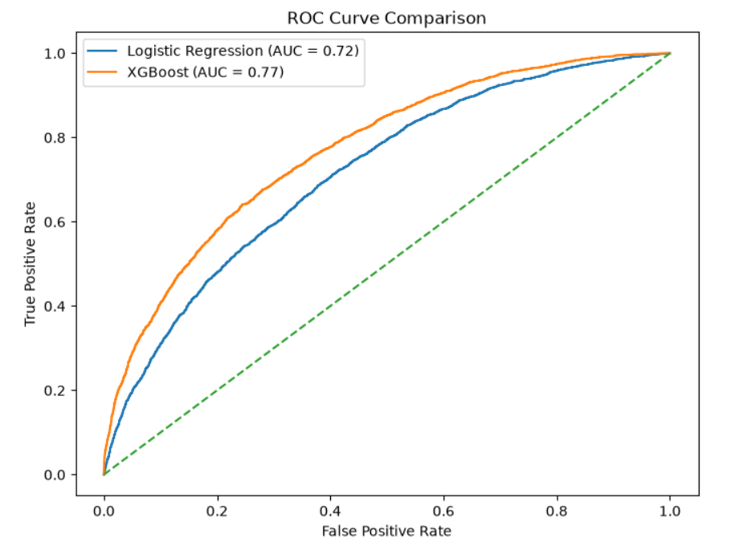
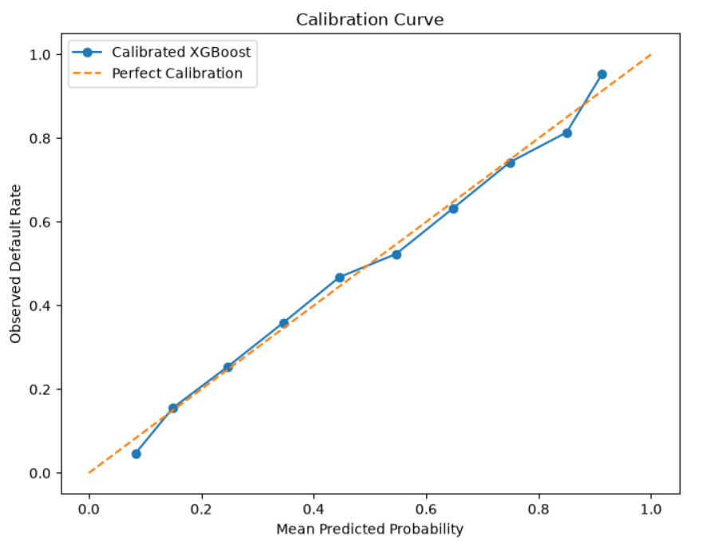
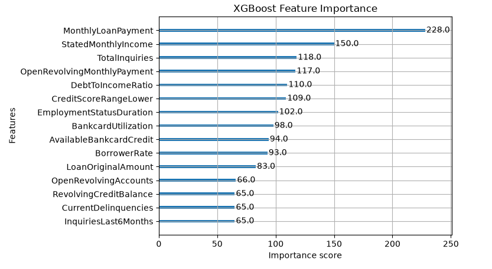
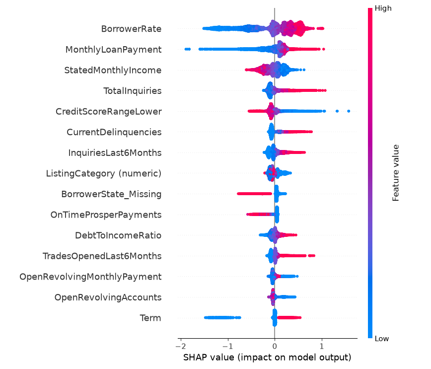
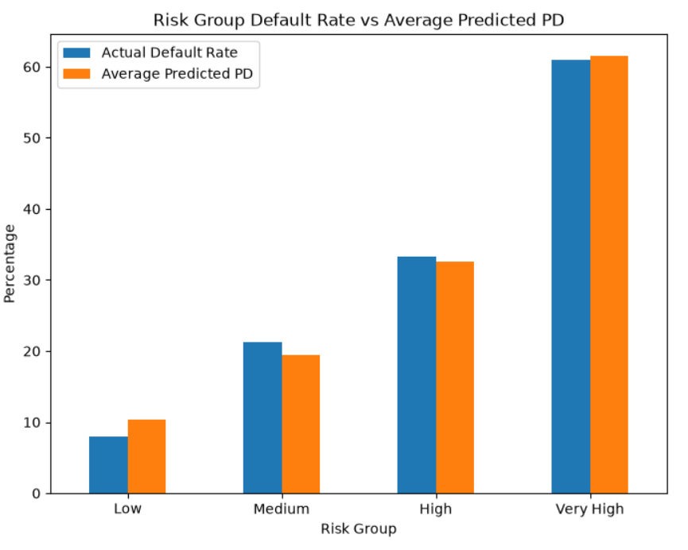

# Logistic Regression & XGBoost for Risk-Based Credit Analysis

## Overview

This project investigates the following research question:

> **"Can machine learning models accurately predict loan default risk, and how can these predictions support risk-based lending decisions?"**

Using Prosper loan data, I developed a credit default risk analysis workflow that goes beyond model prediction by translating predicted risk into risk segments, expected credit loss, and a final lending decision framework.

---

## Key Results

| Metric | Logistic Regression | XGBoost |
|---|---:|---:|
| ROC-AUC | 0.716 | **0.771** |
| Default Precision | 0.60 | **0.67** |
| Default Recall | 0.24 | **0.35** |
| Default F1 | 0.34 | **0.46** |
| KS Statistic | - | **0.396** |

XGBoost achieved stronger overall predictive performance and was therefore used for the subsequent risk analysis.

---

## Project Workflow

**Data → Default Prediction → Model Evaluation → Calibration → Explainability → Risk Segmentation → Expected Loss → Threshold Analysis → Credit Decision**

---

## Dataset

The project uses the **Prosper Loan Data** dataset.

The original dataset contains:

- **113,937 observations**
- **81 variables**

After selecting loans with known outcomes, **55,084 observations** were used for modeling.

The target variable was defined as:

- `0` → Non-Default
- `1` → Default

The resulting default rate was **30.88%**.

---

## Data Preparation

The preprocessing stage included:

- Target variable creation
- Data leakage control
- Removal of identifier variables
- Removal of post-loan performance variables
- Handling of missing values
- Categorical variable encoding
- Train/test split with stratification

The dataset was split into **80% training** and **20% testing** data.

---

## Models

### Logistic Regression

Logistic Regression was used as a baseline classification model for predicting default risk.

### XGBoost

XGBoost was used as the main machine learning model because of its ability to capture nonlinear relationships and interactions between variables.

XGBoost achieved a **ROC-AUC of 0.771**, compared with **0.716** for Logistic Regression.

---

## Model Performance

### ROC Curve



The ROC curve shows that XGBoost provides stronger discrimination between default and non-default loans.

### XGBoost Confusion Matrix


---

## Model Calibration

The predicted default probabilities were calibrated before being used in the subsequent risk and threshold analyses.



---

## Model Explainability

Feature importance and SHAP analysis were used to understand which variables contributed most to the model's predictions.

### XGBoost Feature Importance



### SHAP Summary



The analysis highlights variables such as:

- Monthly Loan Payment
- Stated Monthly Income
- Total Inquiries
- Debt-to-Income Ratio
- Credit Score
- Borrower Rate
- Current Delinquencies

SHAP results are interpreted as model-learned relationships rather than causal effects.

---

## Risk Segmentation

The calibrated default probabilities were divided into four equal-sized risk groups using a quartile-based approach:

- Low
- Medium
- High
- Very High

| Risk Group | Loan Count | Average PD | Actual Default Rate |
|---|---:|---:|---:|
| Low | 2,755 | 10.33% | 7.95% |
| Medium | 2,754 | 19.40% | 21.31% |
| High | 2,754 | 32.65% | 33.33% |
| Very High | 2,754 | 61.52% | 60.93% |

The increasing actual default rate across the risk groups indicates that the model is able to meaningfully rank loans by risk.



---

## Expected Loss

To translate predicted default risk into a monetary risk measure, Expected Loss was calculated using:

**Expected Loss = PD × EAD × LGD**

Where:

- **PD** = Probability of Default
- **EAD** = Exposure at Default, represented by `LoanOriginalAmount`
- **LGD** = Loss Given Default, assumed to be **80%**

| Risk Group | Average PD | Average EAD | Total Expected Loss | Average Expected Loss |
|---|---:|---:|---:|---:|
| Low | 10.33% | 5,717.59 | 1.326M | 481.33 |
| Medium | 19.40% | 6,563.51 | 2.804M | 1,018.19 |
| High | 32.65% | 6,369.62 | 4.544M | 1,649.90 |
| Very High | 61.52% | 6,299.76 | 8.547M | 3,103.65 |

Expected loss increases substantially as the risk level increases.

---

## Threshold Analysis

Different probability thresholds were evaluated by considering:

- Approval rate
- Model performance
- Total expected loss

| Threshold | Approved Loans | Approval Rate | Total Expected Loss |
|---:|---:|---:|---:|
| 0.10 | 1,356 | 12.31% | 467,756 |
| 0.15 | 2,864 | 26.00% | 1,414,600 |
| 0.20 | 4,340 | 39.39% | 2,756,222 |
| **0.25** | **5,521** | **50.11%** | **4,145,449** |
| 0.30 | 6,489 | 58.90% | 5,606,201 |
| 0.35 | 7,337 | 66.60% | 6,961,219 |
| 0.40 | 8,014 | 72.74% | 8,199,999 |
| 0.45 | 8,595 | 78.02% | 9,328,419 |
| 0.50 | 9,027 | 81.94% | 10,417,630 |

The **0.25 threshold** was selected as the final operating point because it provides a balanced trade-off between approval volume, model performance, and expected loss.

---

## Final Lending Decision

The selected threshold was converted into a simple credit decision rule:

```text
PD < 0.25  →  Approve
PD ≥ 0.25  →  Reject
